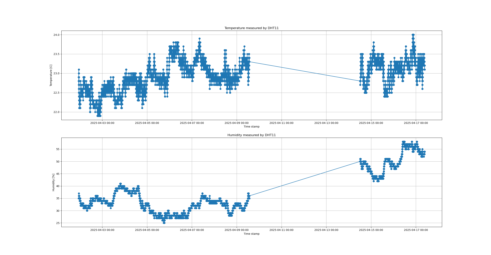

# Wireless Sensor
The purpose of this project is to create a setup for collecting, storing and
displaying sensor data.

## Description
The sensor used is a DTH11, a temperature and humidity sensor. The sensor is
connected to a MCU ESP8266 that publish MQTT messages with the sensor data.
The project has a MQTT broker, Mosquitto, a database, MariaDB and a Python
script running on a Raspberry Pi4. One Python script is used for writing the
sensor data to the database and a second Python script is used to read from the
database and plot the sensor data.

## Getting Started

### Dependencies

* MariaDB - 10.5.28-MariaDB
* MQTT broker - mosquitto version 2.0.11
* MCU - Wemos D1 Mini 
    * PubSubClient 2.8.0 by Nick O'Leary
    * Adafruit DHT sensor library 1.4.6
* Python - 3.9.2
    * paho-mqtt 2.1.0
    * mysql-connector 2.2.9
    * matplotlib 3.3.4
    * numpy 1.19.5

### Installing

1. Clone the repository
1. Build and flash the MCU code via the Arduino IDE 
1. Install the database and the MQTT broker
1. Run the setup_db.sh script to create a database user and tables
1. Run the setup_mqtt.sh script to add a MQTT user to the broker
1. Start the Python script MQTT_to_DB.py to subscribe to the sensor topic and
write the data to the database
1. Run the Python script DB_to_plot.py to plot the sensor data

## Author
Sara Rydh

## License
This project is licensed under the GPL License - see the LICENSE.md
file for details.